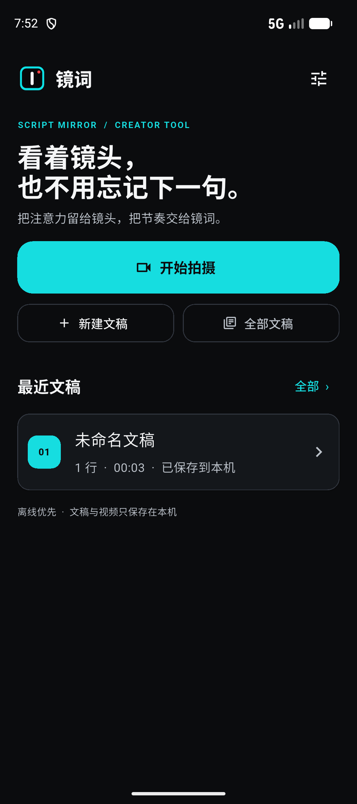
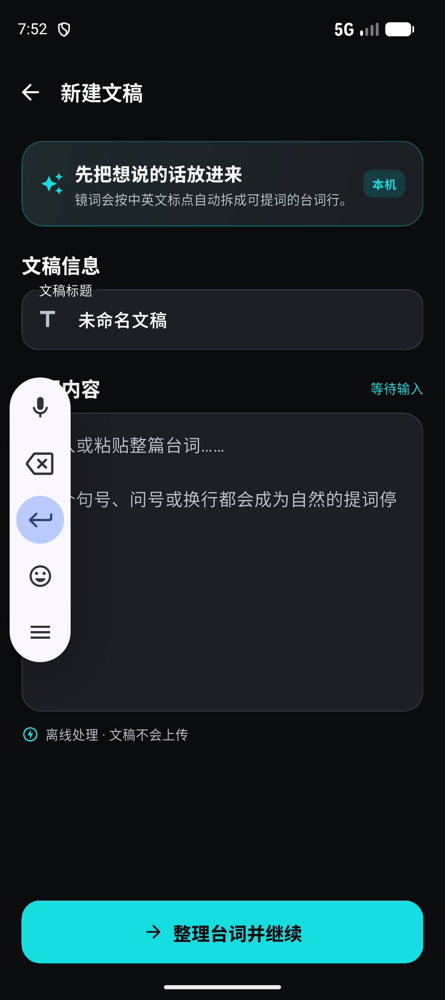
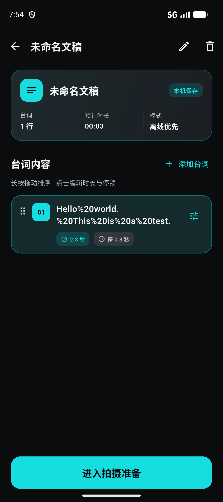
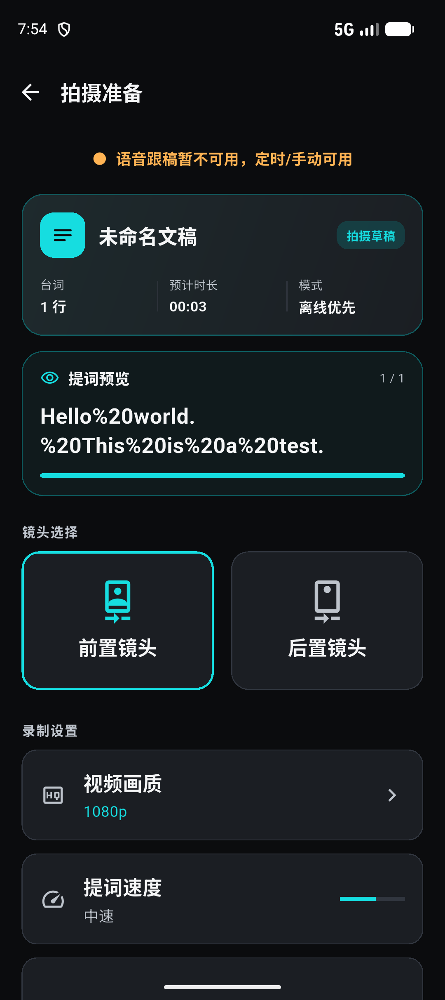
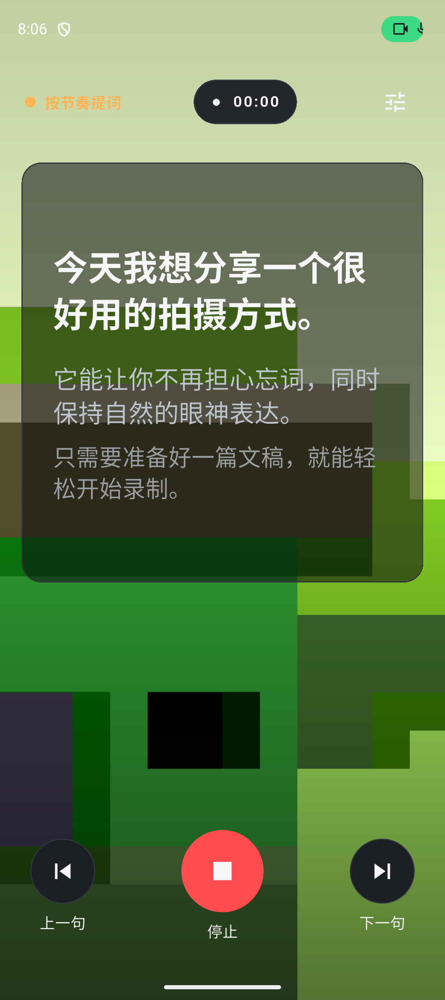
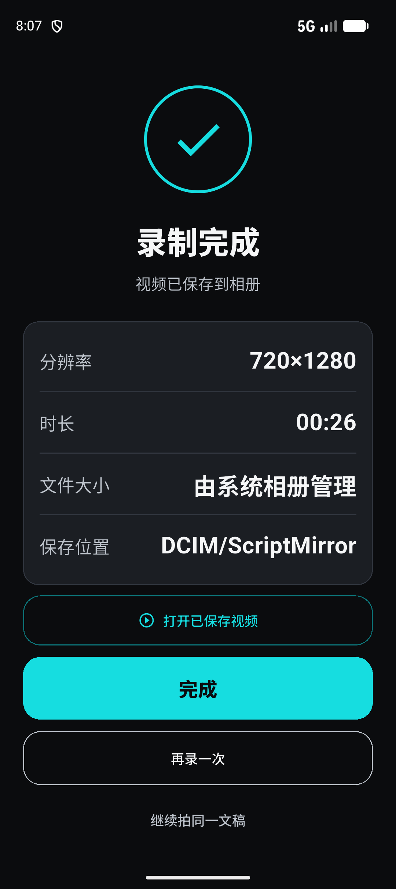

# 镜词 / ScriptMirror

这是一个 Android-first、local-first 的自拍视频提词器。当前首批界面基于 `stitch_scriptmirror_app_design_ui` 的视觉稿实现为 Flutter UI，并已经生成 Android 平台工程（当前验收版本 `0.1.1+2008`）：

- 首页与最近文稿
- 文稿行编辑、拆分/合并、重命名、删除和拖动排序；新建与编辑返回时都保护未保存改动
- 独立的新建文稿工作台（实时字数/分句统计、离线提示、大输入区）
- 拍摄准备（镜头、画质、提词速度、自动推进开关）
- 沉浸式录制页（CameraX 预览/录制桥接、计时、手动翻句、ASR 视觉状态）
- 完成页、录制中断恢复提示与设置页

首页的“开始拍摄”从稳定的默认示例文稿进入，首次录制被系统打断后也能恢复；停止后音视频合并期间会锁定录制控制，避免误触改变即将保存的提词位置。

后续用 v0.dev 做视觉精修时，可直接使用项目内的 [V0_REFINEMENT_PROMPT.md](V0_REFINEMENT_PROMPT.md)，并把 `stitch_scriptmirror_app_design_ui` 中的截图作为参考输入。

Pen.dev 高保真精修稿已保存在 [ScriptMirror_UI_Refined.pen](ScriptMirror_UI_Refined.pen)，包含首页、脚本编辑、新建文稿、拍摄准备、沉浸式录制、完成页和设置画板，并额外保留了可复用的提词预览组件。设计稿只负责视觉与交互评审，Flutter 的 SQLite、CameraX、恢复和 ASR 契约保持不变。

极简版 App logo 已落在 [assets/branding/scriptmirror-logo-v2.png](assets/branding/scriptmirror-logo-v2.png)，同时用于首页品牌标记、Android launcher 和冷启动 SplashScreen；设计说明见 [assets/branding/README.md](assets/branding/README.md)。Android 12+ 使用 adaptive icon 安全区，避免系统圆形遮罩裁切 Logo。

## 界面预览

下面是当前 Flutter 实现的主要界面，覆盖从文稿录入到录制完成的完整路径：

<table>
  <tr>
    <td align="center"><br><sub>首页</sub></td>
    <td align="center"><br><sub>新建文稿</sub></td>
    <td align="center"><br><sub>文稿编辑</sub></td>
  </tr>
  <tr>
    <td align="center"><br><sub>拍摄准备</sub></td>
    <td align="center"><br><sub>沉浸式录制</sub></td>
    <td align="center"><br><sub>录制完成</sub></td>
  </tr>
</table>

设计探索和交互精修文件也随仓库提供：

- [Stitch 设计稿与导出截图](stitch_scriptmirror_app_design_ui)
- [Pen.dev 高保真精修稿](ScriptMirror_UI_Refined.pen)
- [v0 精修提示词](V0_REFINEMENT_PROMPT.md)

## 当前状态

当前已经接入 CameraX（Android 官方 Camera2 之上的原生相机栈）的预览、默认 1080p 录制（可切换 720p，设备不支持时自动降级）、单一原生麦克风所有者、共享 PCM 音频分发、AAC 音频编码与 MediaStore 合并保存，以及 SQLite 文稿/设置/恢复记录。前置自拍预览可按“自拍镜像”设置保持熟悉的镜像取景；开启时 `VideoCapture` 同样使用 `MIRROR_MODE_ON_FRONT_ONLY`，让保存到相册的脸部方向与录制时看到的自己保持一致（文字也会随之镜像），关闭时预览与成片均为正常方向；预览和录制 use case 还绑定同一个 `ViewPort` 与当前屏幕旋转，保证满屏取景与最终视频使用同一块传感器区域，避免画面偏移或构图不一致；在开始录制和屏幕配置变化时刷新旋转，合并音视频时保留 CameraX 的旋转元数据，避免部分设备的成片横向或画面倾斜；Android 10+ 固定写入系统相册的 `DCIM/ScriptMirror`，Android 8/9 优先使用同一目录，若旧存储提供者拒绝应用创建目录则回退到 MediaStore 的标准共享视频位置，完成页也提供直接打开已保存视频的入口。录制页支持慢速/中速/快速的按时长自动推进和手动翻句，长台词会在提词面板内自适应缩放；宿主暂停时原生录制会主动收尾，并在恢复后显示真实的保存结果和可继续的台词位置；系统检测到高温时仅显示建议切换 720p 的提示，不强行中断当前录制。取消按钮在 CameraX 刚完成启动、Flutter 状态尚未切换的竞态窗口里也会由原生层丢弃刚启动的片段；系统切后台则保留已开始的片段并走中断恢复流程，系统返回键也会先确认“结束并保存”或“离开”，避免误触直接销毁录制页。Flutter 侧现在使用随包内置的 sherpa-onnx 中文 streaming CTC 模型，并在倒计时前完成本地模型预热：识别完全在本机 CPU 运行，不申请网络权限、不上传音频，ASR provider 只消费录制所有者共享的 PCM。非 Android 平台和 Flutter widget 测试使用预览录制服务，不会伪报视频已保存。

模型和词表在复制到应用私有目录前会校验固定 SHA-256；已有缓存若校验不通过会自动重写，校验失败则明确降级为定时/手动提词。每次进入录制准备时，还会仅清理应用自己的 `DCIM/ScriptMirror` 下超过 1 小时的 pending 媒体行和 `.pending-…ScriptMirror_*.mp4` 孤儿临时文件，避免进程异常退出后的残留空间长期累积。

项目的 Flutter SDK 安装与平台模板生成必须在可运行的 Flutter/Dart 环境中完成：

```sh
flutter pub get
flutter run -d <android-device>
flutter build apk --release
# 可选：生成可互相覆盖安装的分 ABI 包
flutter build apk --release --split-per-abi --android-project-arg force-version-code-ignoring-abi=true
```

最后一轮真机验收请按 [DEVICE_QA.md](DEVICE_QA.md) 执行；模拟器无法代替真实镜头、麦克风和系统相册对前置镜像、旋转及离线识别的确认。

若要单独回归随包模型，可用项目内的主机端烟测脚本（需要一个 16 kHz、单声道 WAV；脚本不会打开麦克风）：

```sh
dart run tool/sherpa_asr_smoke.dart /path/to/16k-mono.wav
```

若要同时回归“ASR partial → 稳定翻句”，可运行组合烟测；第二个参数可要求至少翻过几句：

```sh
dart run tool/sherpa_alignment_smoke.dart /path/to/16k-mono.wav
# 多句连续口播至少验证两次单调推进
dart run tool/sherpa_alignment_smoke.dart /path/to/16k-mono.wav 2
```

该脚本同样不会打开麦克风或联网。

## 开源开发

代码以 [MIT License](LICENSE) 发布，欢迎通过 Issue 或 Pull Request 改进 UI、补充设备兼容性记录或完善录制体验。提交前请运行：

```sh
flutter analyze
flutter test
(cd android && ./gradlew lintRelease)
```

贡献相机、音频、镜像、旋转或 ASR 相关功能时，请在说明中记录真实设备型号、Android 版本、前/后置镜头和复现步骤。完整约定见 [CONTRIBUTING.md](CONTRIBUTING.md)。

随包 sherpa-onnx 模型来自 [sherpa-onnx](https://github.com/k2-fsa/sherpa-onnx)；重新分发包含模型的构建时，请同时核对上游项目及模型文件的许可证和署名要求。

Release APK 已启用 R8/ProGuard、资源压缩和 JNI 库压缩；通用包约 75MB，arm64 手机包约 40MB，模拟器 x86_64 包约 42MB，均包含离线识别模型。分 ABI 构建建议带上 `--android-project-arg force-version-code-ignoring-abi=true`，这样通用包和分 ABI 包保持同一 versionCode，可互相覆盖安装。原生 `NativeCaptureController` + `NativeAudioCapture` 是录制期间唯一的音频所有者；`SherpaAsrProvider` 订阅同一条共享 PCM 流，避免多个插件同时抢占麦克风。这里的“原生相机”指 App 内嵌的 Android CameraX/Camera2 相机栈；若改为直接拉起手机自带相机 App，提词文字将无法继续叠加在取景画面上。

当前 Release APK 使用本地测试签名，适合直接安装验收；正式发布到应用商店前仍需替换为项目自己的 release keystore。
